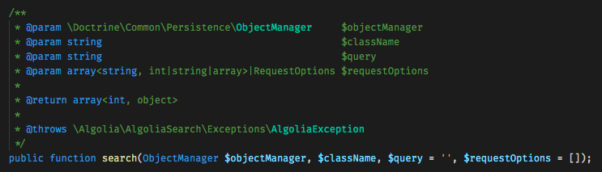

## Upgrading from 3.4.0 to 4.0.0

The new SearchBundle is now based on our [PHP Client v2](https://www.algolia.com/doc/api-client/getting-started/install/php/). In addition to providing you with all the new features our PHP Client v2 has to offer, it has been redesigned to give the most intuitive and easy-to-use experience. 
For that reason, we tried to make the architecture as clear as possible and we got rid of the Search Engine-agnostic feature. As an example, `AlgoliaEngine` and `IndexManager` classes have been merge into one single `SearchService` class.
Also, the Algolia Client is now public. Its methods signatures and return types have however changed from v1 to v2. Please read carefully our [PHP Client v2 upgrade guide](https://www.algolia.com/doc/api-client/getting-started/upgrade-guides/php/) to get a list of thoses changes.

We attempt to document every possible breaking change. Since some of these breaking changes are in obscure parts of the API Client, only a portion of these changes may affect your application.

Upgrade your `algolia/search-bundle` dependency from `^3.4` to `4.0.0-alpha1` in your `composer.json` file and run `composer update algolia/search-bundle algolia/algoliasearch-client-php` in your terminal.


## Miscellaneous

We strongly encourage you to take a look at the [PHP Client v2 upgrade guide](https://www.algolia.com/doc/api-client/getting-started/upgrade-guides/php/) to get acquainted with the new features deployed in this version.


## Improved DX with the usage of our PHP Client v2
Its entire redesign makes it faster and easier to use, but don't worry about the method signature changes: most of the the previous usage stay the same, everything is transparent to you. You will also benefit from its new features, the Algolia Client being now public (it relies on your ALGOLIA_APP_ID and ALGOLIA_API_KEY env variables), like the possibility to copy a whole index, to copy all the rules from an index, to replace all data in one index, creating secured API keys, and more. We also added better Exceptions, made the instantiation of the clients easier, and created many more features to help you have the best possible experience with Algolia. Please head over the [PHP Client v2 upgrade guide](https://www.algolia.com/doc/api-client/getting-started/upgrade-guides/php/) to know more.

Examples:

```php
/**
* Either autowire the SearchClient service
*/

use Symfony\Bundle\FrameworkBundle\Controller\AbstractController;

class ArticleController extends AbstractController
{
    private $searchService;

    public function __construct(SearchServiceInterface $searchService)
    {
        $this->searchService = $searchService;
    }

    public function test(SearchClient $client)
    {
        // Copy an index
        $client->copyIndex(SRC_INDEX_NAME, DEST_INDEX_NAME);

        // Copy all the rules from an index
        $client->copyRules(SRC_INDEX_NAME, DEST_INDEX_NAME);

        // Replace all objects
        $index = $client->initIndex(DEST_INDEX_NAME);
        $index->replaceAllObjects($objects);
    }
}
```

```php
/**
* Or fetch it directly from the container. Note that the Controller class is deprecated.
*/

use Symfony\Bundle\FrameworkBundle\Controller\Controller;

class ArticleController extends Controller
{
    private $searchService;

    public function __construct(SearchServiceInterface $searchService)
    {
        $this->searchService = $searchService;
    }

    public function test(SearchClient $client)
    {
        $client = $this->get('search.client');
        // Copy an index
        $client->copyIndex(SRC_INDEX_NAME, DEST_INDEX_NAME);

        // Copy all the rules from an index
        $client->copyRules(SRC_INDEX_NAME, DEST_INDEX_NAME);

        // Replace all objects
        $index = $client->initIndex(DEST_INDEX_NAME);
        $index->replaceAllObjects($objects);
    }
}
```

## Waitable operations
Methods from the `SearchService` are now *waitable*. You can rely on the [`wait()`](https://www.algolia.com/doc/api-reference/api-methods/wait-task/) method to wait for your task to be completely handled by the Engine before moving on, while previously you had to make a separate query swith the taskID returned from the operation to achieve the same result. The `wait()` method can be chained on any methods from the `SearchService`. 

Examples: 
```php
// index objects and wait for the task to finish
$response = $this->searchService->index($entityManager, $objects)->wait();

// clear an index
$response = $this->searchService->clear($className)->wait();
```

That also means that the return type of those methods has changed. They now all return an Algolia `AbstractResponse`. Please update your code accordingly.

## All the logic in one single service
The bundle has been made much more simple with the merge of the two classes `AlgoliaEngine` and `IndexManager` to one `SearchService`. The `SearchService` is your only entry point for any operation on the engine.

## Add any options to your operations
To have the most consistent, predictable, and future-proof method signature, we followed three rules:

- All required parameters have a single argument each
- All optional arguments are passed in an array (or RequestOptions object), as the last argument, and is called `$requestOptions`
- The client never sets any default values

So you now have the possibility to pass any optional arguments and options to the engine in the `$requestOptions` parameter, available in all `SearchService` methods. You can for example add [filters](https://www.algolia.com/doc/api-reference/api-parameters/filters/), choose which [facets](https://www.algolia.com/doc/api-reference/api-parameters/facets/) to retrieve, change the number of [hits per page](https://www.algolia.com/doc/api-reference/api-parameters/hitsPerPage/), pass new headers, etc.

Here are a few examples:


```php
# v3
$result = $this->indexManager->remove(
    $searchablePosts,
    $this->get('doctrine')->getManager(),
    // you could not pass requestOptions
);

# v4
$result = $this->searchService->remove(
    $this->get('doctrine')->getManager(),
    $searchablePosts,
    // here you can pass any requestOptions, for example 'X-Forwarded-For', 'X-Algolia-UserToken'...
    [
        'X-Forwarded-For' => '0.0.0.0',
    ]
);
```

```php
# v3
$result = $this->indexManager->search(
    'foo',
    Post::class,
    $this->get('doctrine')->getManager(),
    // the optional page and hitsPerPage parameters were passed separately
    // page argument was starting from 1
    1,
    20,
    'attributesToRetrieve' => [
        'title',
    ],
);

# v4
$result = $this->searchService->search(
    $this->get('doctrine')->getManager(),
    Post::class,
    'foo',
    // all the optional parameters are now sent as once in the $requestOptions
    // be careful as page argument now starts from 0
    [
        'page'                 => 0,
        'hitsPerPage'          => 20,
        'attributesToRetrieve' => [
            'title',
        ],
    ]
);
```

## And also
* Better doc blocks to improve the public API and auto-completion.

* Better quality tooling, so the bundle is now extra robust and future-proof.


## List of changes in fully qualified namespaces
<div class="overflow-x-auto">
<table>
<thead>
<tr>
<th>3.4.0</th>
<th>Breaking Change</th>
<th>4.0.0</th>
</tr>
</thead>
<tbody>
    <tr>
        <td><code>Algolia\SearchBundle\Engine\AlgoliaEngine</code></td>
        <td>Removed</td>
        <td>/</td>
    </tr>
    <tr>
        <td><code>Algolia\SearchBundle\IndexManager</code></td>
        <td>Renamed</td>
        <td><code>Algolia\SearchBundle\SearchService</code></td>
    </tr>
    <tr>
        <td><code>Algolia\SearchBundle\IndexManagerInterface</code></td>
        <td>Renamed</td>
        <td><code>Algolia\SearchBundle\SearchServiceInterface</code></td>
    </tr>
    <tr>
        <td><code>Algolia\SearchBundle\Engine\NullEngine</code></td>
        <td>Removed</td>
        <td>For testing purposes use <code>Algolia\SearchBundle\SearchServiceInterface</code> by mocking it or extending it and overriding the `search.service` in your test config (see https://symfony.com/doc/current/configuration.html#configuration-environments)</td>
    </tr>
</tbody>
</table>
</div>


## List of classes that became internal

The following classes are now internal and may not respect semantic versioning. Those classes are not meant to be 
used directly and may be up to changes in minor versions.

* `Algolia\SearchBundle\Command\SearchClearCommand`
* `Algolia\SearchBundle\Command\SearchImportCommand`
* `Algolia\SearchBundle\Command\SearchSettingsBackupCommand`
* `Algolia\SearchBundle\Command\SearchSettingsCommand`
* `Algolia\SearchBundle\Command\SearchSettingsPushCommand`
* `Algolia\SearchBundle\DependencyInjection\AlgoliaSearchExtension`
* `Algolia\SearchBundle\DependencyInjection\Configuration`
* `Algolia\SearchBundle\EventListener\SearchIndexerSubscriber`
* `Algolia\SearchBundle\Searchable`
* `Algolia\SearchBundle\SearchableEntity`
* `Algolia\SearchBundle\SettingsManager`


## List of deleted interfaces and final classes you should use instead
<div class="overflow-x-auto">
<table>
<thead>
<tr>
<th>3.4.0</th>
<th>Breaking Change</th>
<th>4.0.0</th>
</tr>
</thead>
<tbody>
    <tr>
        <td><code>Algolia\SearchBundle\Settings\SettingsManagerInterface</code></td>
        <td>Removed</td>
        <td><code>Algolia\SearchBundle\Settings\SettingsManager</code></td>
    </tr>
    <tr>
        <td><code>Algolia\SearchBundle\Engine\EngineInterface</code></td>
        <td>Removed</td>
        <td>/</td>
    </tr>
    <tr>
        <td><code>Algolia\SearchBundle\Engine\IndexManagerInterface</code></td>
        <td>Removed</td>
        <td><code>Algolia\SearchBundle\SearchService</code></td>
    </tr>
</tbody>
</table>
</div>


## List of updated public services names
<div class="overflow-x-auto">
<table>
<thead>
<tr>
<th>3.4.0</th>
<th>Breaking Change</th>
<th>4.0.0</th>
</tr>
</thead>
<tbody>
    <tr>
        <td><code>search.index_manager</code></td>
        <td>Renamed</td>
        <td><code>search.service</code></td>
    </tr>
    <tr>
        <td><code>algolia_client</code><br>(setup publicly manually, you may not have been using it)</td>
        <td>Renamed</td>
        <td><code>search.client</code> or `SearchClient` class autowired</td>
    </tr>
</tbody>
</table>
</div>

## SearchService

`IndexManager` has been renamed to `SearchService`. This is the only service you will need to interact with Algolia.

Previously, to get started:

```php
namespace App\Controller;

use Symfony\Bundle\FrameworkBundle\Controller\Controller;
use Algolia\SearchBundle\IndexManagerInterface;

class ExampleController extends Controller
{
    protected $indexManager;

    public function __construct(IndexManagerInterface $indexingManager)
    {
        $this->indexManager = $indexingManager;
    }
}
```

Now, in the `4.0.0` you should update your code to:

```php
namespace App\Controller;

use Symfony\Bundle\FrameworkBundle\Controller\Controller;
use Algolia\SearchBundle\SearchServiceInterface;

class ExampleController extends Controller
{
    protected $searchService;

    public function __construct(SearchServiceInterface $searchService)
    {
        $this->searchService = $searchService;
    }
}
```

##### List of Method Signature Changes

<div class="overflow-x-auto">
<table>
<thead>
<tr>
<th>3.4.0</th>
<th>Breaking Change</th>
<th>4.0.0</th>
</tr>
</thead>
<tbody>
    <tr>
        <td><code>getSearchableEntities(): array&lt;int, string&gt;</code></td>
        <td>Renamed</td>
        <td><code>getSearchableEntities(): array&lt;int, string&gt;</code></td>
    </tr>
    <tr>
        <td><code>getFullIndexName($className): string</code></td>
        <td>Renamed</td>
        <td><code>searchableAs($className): string</code></td>
    </tr>
    <tr>
        <td><code>index($entities, ObjectManager $objectManager): array&lt;string, int&gt;</code></td>
        <td>Changed</td>
        <td><code>index(ObjectManager $objectManager, $searchables, $requestOptions = []): array&lt;int, array&lt;string, \Algolia\AlgoliaSearch\Response\AbstractResponse&gt;&gt;</code></td>
    </tr>
    <tr>
        <td><code>remove($entities, ObjectManager $objectManager): array&lt;string, int&gt;</code></td>
        <td>Changed</td>
        <td><code>remove(ObjectManager $objectManager, $searchables, $requestOptions = []): array&lt;int, array&lt;string, \Algolia\AlgoliaSearch\Response\AbstractResponse&gt;&gt;</code></td>
    </tr>
    <tr>
        <td><code>clear($className): boolean</code></td>
        <td>Changed</td>
        <td><code>clear($className): \Algolia\AlgoliaSearch\Response\AbstractResponse</code></td>
    </tr>
    <tr>
        <td><code>delete($className): boolean</code></td>
        <td>Changed</td>
        <td><code>delete($className): \Algolia\AlgoliaSearch\Response\AbstractResponse</code></td>
    </tr>
    <tr>
        <td><code>search($query, $className, ObjectManager $objectManager, $page = 1, $nbResults = null, array $parameters = []): array&lt;int, object&gt;</code></td>
        <td>Changed</td>
        <td><code>search(ObjectManager $objectManager, $className, $query = '', $requestOptions = []): array&lt;int, object&gt;</code></td>
    </tr>
    <tr>
        <td><code>rawSearch($query, $className, $page = 1, $nbResults = null, array $parameters = []): array&lt;string, int|string|array&gt;</code></td>
        <td>Changed</td>
        <td><code>rawSearch($className, $query = '', $requestOptions = []): array&lt;string, int|string|array&gt;</code></td>
    </tr>
    <tr>
        <td><code>count($query, $className, array $parameters = []): int</code></td>
        <td>Changed</td>
        <td><code>count($className, $query = '', $requestOptions = []): int</code></td>
    </tr>
</tbody>
</table>
</div>


